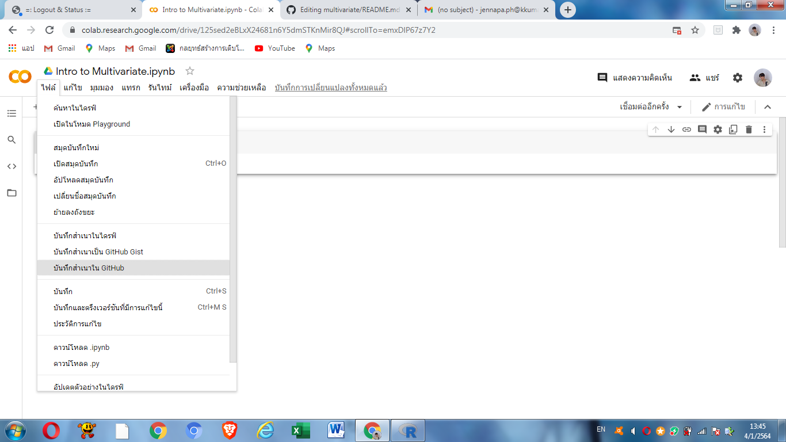
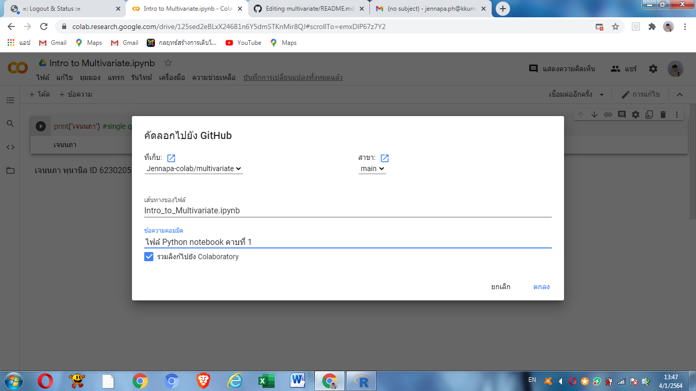
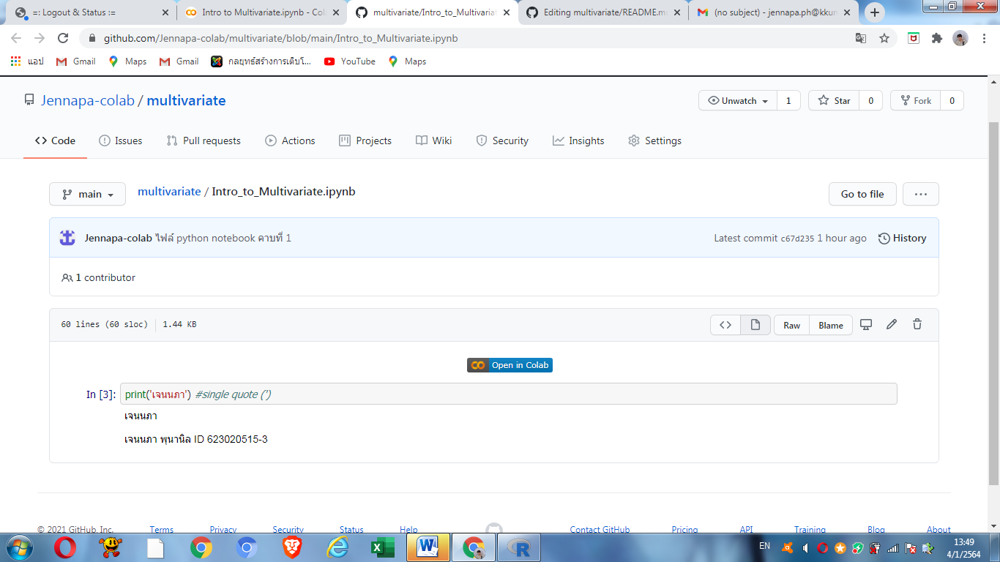

# multivariate

### เจนนภา พุนานิล ID 623020515-3

.md => Markdown

![_] square brackets

( ) parentheses

อธิบายการใช้งาน Github และ google Colab ว่าหน้าที่ของแต่ละอันคืออะไร และอธิบายวิธีเซฟไฟล์จาก Google Colab ลงใน Github

//Github เป็นการใช้งานแบบ Version control ที่จัดเก็บความเปลี่ยนแปลงของไฟล์ในโปรเจคของเราหรือของทีม โดยคนที่เข้ าGithub จะสามารถเปลี่ยนแปลง, เพิ่ม, ลบสิ่งต่างๆในโปรเจคไปพร้อมๆกันได้ เป็นตัวกลางในการส่งโปรเจคที่กำลังทำให้คนอื่นสามารถเข้ามาดูได้

//Google Colab เป็นสิ่งที่สามารถเขียนโค้ด Python ได้ในตัว โดยในตัว Google Colab นั้นจะมีทั้ง Code cell และ Text cell เพื่อให้ตัวผู้ทำโปรเจคนั้นๆมีทั้งการเขียนอธิบายวิธีการต่างๆหรือหน้าที่ของโค้ดนั้นๆได้ และตัว Google Colab นั้นยังสามารถเซฟลงใน Drive หรือที่ต่างๆได้และทำให้ง่ายต่อการใช้งาน

//วิธีการเซฟไฟล์จาก Google Colab ลงใน Github 

เมื่อพิมพ์งานใน Google Colab เสร็จแล้วให้กดที่คำว่า File จากนั้นเลือกที่คำว่า บันทึกสำเนาใน (GitHubSave a coppy in GitHub)

เมื่อกดเสร็จแล้วให้เลือกโปรเจคที่ต้องการจะ Save ในครั้งนี้เราจะเลือกเป็น Multivariate จากนั้นกดตรงช่อง Commit message แล้วตั้งชื่อที่ต้องการจะcommit สุดท้ายจึงกด OK

เมื่อบันทึกสำเร็จ ผลจะออกดังรูปข้างบน 

เมื่อเซฟไฟล์เข้า Github ได้สำเร็จจะขึ้นหน้าบราวเซอร์นี้ขึ้นมา
//วิธีการแทรกรูป Markdown
